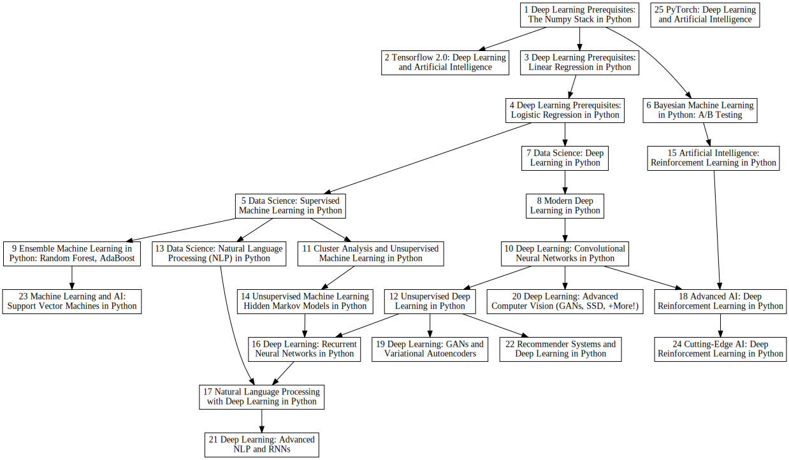

# Suggested Order for Lazy Programmer Courses

* Rendered with Graphviz
* dot_diagram.dot has the dot program
* dot_diagram.svg has a rendering

If you don't have Graphviz installed you can try an online site, such as this one: https://dreampuf.github.io/GraphvizOnline. Just copy and paste the dot code. 

Based on info from this page: https://deeplearningcourses.com/course_order 

Here's what the rendered graph looks like:

